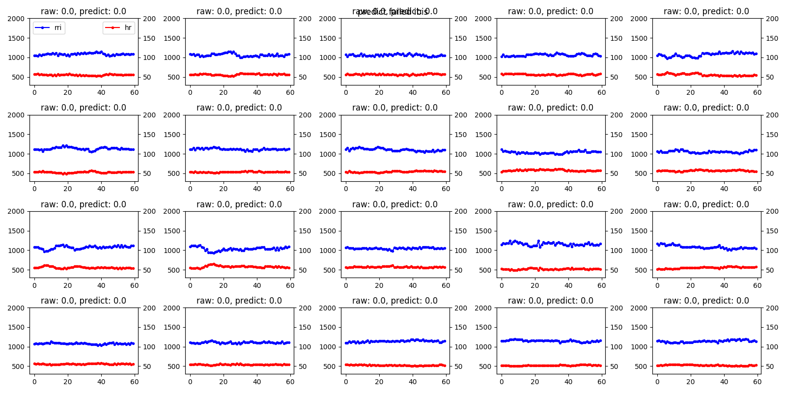
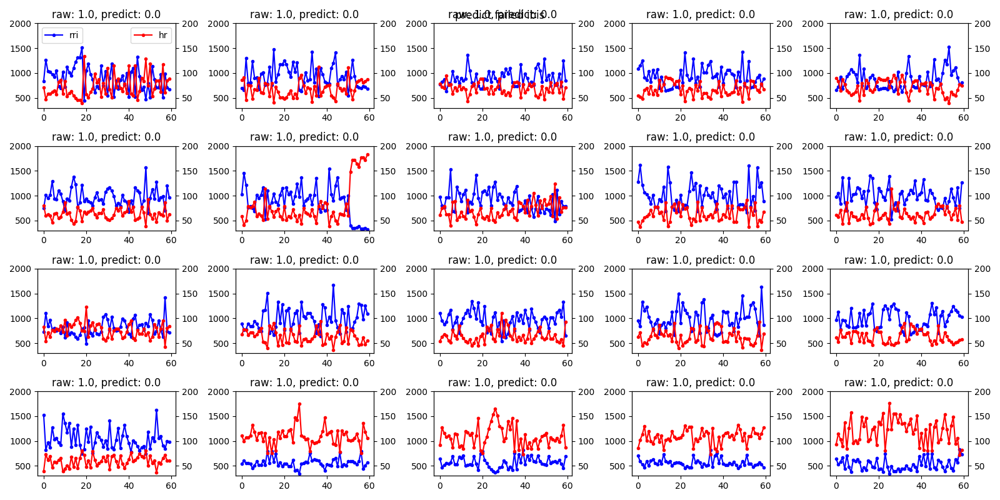

# Time Series Abnormal Detection

## Training data

RRI interval from ecg signals(normed)

data length: 60

data dimension: 1

## Theoretical Basis

google:

"Autoencoder Abnormal Detection"

"Autoencoder Outlier Detection"

"Deep learning Outlier Detection"

Base steps:

1. build a model to generate signals like raw input

2. apply model to a abnormal input

3. check model output to determine and making a decision

## TODO

- [x] Autoencoder based on MLP

- [x] Autoencoder based on CNN

- [ ] Autoencoder based on RNN/LSTM

- [ ] Autoencoder based on CNN+RNN

- [ ] VAE model

- [ ] Some other adversarial models like GAN

- [ ] Methods based on Machine Learning / Features

## Code Structure & Use

`train.py` --> train model

`test.py` --> run model

`model*.py` --> models

`*.npy` --> training data or test data, (may need to unzip)

`*.pickle` --> raw data, need to transform to apply a model

## Smaple output

|           normal beats            |            anormal beats            |
| :-------------------------------: | :---------------------------------: |
|  |  |
